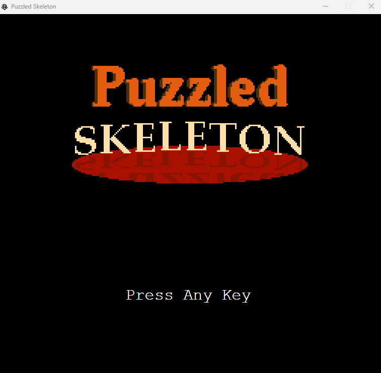
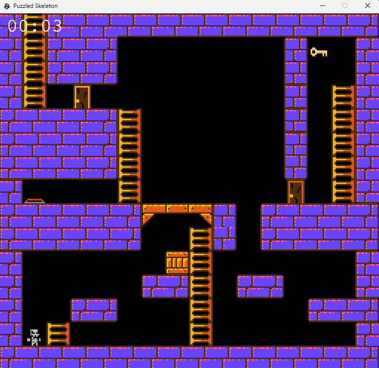

# Puzzled-Skeleton

Puzzled-Skeleton is a small C# WPF game where the player, a skeleton who was once human, must navigate through a series of dungeon chambers to find a way out. Along the journey, the skeleton discovers a photo from its past, which restores it to its human form. The game is built using C# with WPF for the interface and visuals.

|  |  |
|:--:|:--:|
| **MainMenu** | **Level Design** |

## Features
- **Spikes** – Deadly traps that cause the player to respawn.
- **Movable Boxes** – Push and position boxes to solve puzzles.
- **Keys and Openable** Doors – Collect keys to unlock new paths.
- **Lava Hazards** – Avoid deadly lava pools scattered through levels.
- **5 Playable Levels** – Explore multiple dungeons, each with unique puzzles and difficulty.

## Getting Started

### Prerequisites

Ensure you have the following installed on your system:
- Runtime: .NET SDK 8.0
- Build tools: Visual Studio 2022

### Building

Build instructions for this project can be found in the [BUILDING.md](BUILDING.md) file. Supported platforms are:
- **Windows**: Visual Studio 2022

## TODO List

---
### Priorities
🟩 **Must have** – Game won’t work without it 
🟨 **Should have** – Very important, adds major value 
🟧 **Could have** – Nice-to-have, improves experience 
🟥 **Would have / Wont have** – Extra polish, not needed for gameplay 

---

- [x] 🟨 Rename repository

- [ ] Core Systems
  - [x] Renderer
    - [x] 🟩 Quad renderer
    - [x] 🟩 Textured quad
    - [x] 🟩 Texture coordinates
    - [x] 🟩 Make pixel space
    - [x] 🟩 Flip Y-axis
    - [x] 🟩 US22 Improve efficiency
    - [x] 🟩 Animation system
    - [x] 🟩 Flip sprites
  - [x] Audio
    - [x] 🟩 Play wav sounds
    - [x] 🟧 Stop creating/opening a new file object each time
    - [x] 🟩 Close audio on close window to prevent lag/screen tear
  - [x] Input
    - [x] 🟩 Live key readback (IsKeyPressed())
    - [x] 🟩 Live mouse readback (IsMouseButtonPressed())
    - [x] 🟩 Live mouse position readback (GetMousePosition())
  - [x] UI
    - [x] 🟩 Font caching
    - [x] 🟩 Draw text
    - [x] 🟩 Remove text class
  - [ ] Scene
    - [x] 🟩 Fix UICanvas blocking GameCanvas
    - [ ] 🟧 Allow for scene passthrough of control of objects (sounds)

- [x] Core Game
  - [x] UI
    - [x] Global
      - [x] 🟩 US21/US41 Simpele interface
    - [x] Menus
      - [x] 🟩 Main Menu
        - [x] 🟩 "Press Any Key" Font selection
      - [x] 🟨 Pause Menu
      - [ ] 🟥 Level Menu
      - [x] 🟩 Win Menu + Score + Leaderboard
      - [x] 🟩 Save (selection) Menu
      - [x] 🟨 Level overlay
      - [ ] 🟥 Final win menu (showing achievements)
      - [x] 🟥 Options menu (sound slider)
  - [x] Levels
    - [x] Global
      - [x] 🟩 Level loading from disk
    - [ ] Design
      - [x] 🟩 Level 1 (🟩 normal / 🟧extra hard)
      - [x] 🟨 Level 2 (🟨 normal / 🟧extra hard)
      - [x] 🟨 Level 3 (🟨 normal / 🟧extra hard)
      - [x] 🟨 Level 4 (🟨 normal / 🟧extra hard)
      - [x] 🟨 Level 5 (🟨 normal / 🟧extra hard)
      - [x] 🟨 Level 6 (🟨 normal / 🟧extra hard)
      - [x] 🟧 Texture for skeleton
      - [ ] 🟧 Texture for background(s)
      - [x] 🟧 Texture for objects
      - [x] 🟧 Texture for platform blocks
  - [ ] Mechanics
    - [x] 🟩 Gravity
    - [x] 🟩 Physics (gravity/collision)
    - [x] 🟩 Movement (WASD/Arrow keys)
    - [x] Puzzle mechanics
      - [x] 🟩 Time = score
      - [x] 🟧 Movable bricks (on to moving platform?)
      - [ ] 🟧 UV Flashlight
    - [x] Trap mechanics
      - [x] 🟧 US23 Spike (respawn bottom level)
  - [ ] Audio
    - [x] 🟨 Main menu/save selection music (Start-up, loop)
    - [x] 🟧 Level 1
    - [ ] 🟧 Level 2
    - [ ] 🟧 Level 3
    - [ ] 🟧 Level 4
    - [ ] 🟧 Level 5
    - [ ] 🟧 Level 6
    - [x] 🟧 Win/finish menu
    - [ ] 🟥 Sound for beating your high score (SFX)
    - [ ] 🟥 Final win menu
    - [x] 🟨 Jump SFX
    - [ ] 🟥 Moving brick
    - [ ] 🟧 Flashlight click
    - [ ] 🟧 Moving sound
    - [x] 🟧 Collect key sound
    - [ ] 🟧 Open door with key sound
  - [ ] Easter eggs + Achievements
    - [ ] 🟥 25x piano note
    - [ ] 🟥 Mario (UV flashlight reveal)

## License

All rights reserved.

This project is provided for viewing purposes only.  
You may not copy, modify, distribute, or use any part of this code  
without explicit written permission from the authors.

## Contributing

Contributions are welcome! Please fork the repository and create a pull request with your changes.
